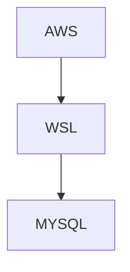
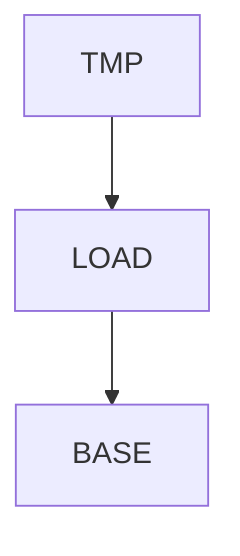

## 첫 번째 파이프라인 구현

오늘은 `DB`와 `MySQL`의 기본적인 architecture를 설명하시면서 수업을 시작했다.

`DB`는 결국 하나의 파일시스템이며 스토리지 엔진에서 처리된다. 그리고 엔진 위에 여러가지가 있지만 특히 `파서(Parser)`와 `옵티마이저(Optimizer)`에 대해 알아야 한다고 하셨다. 파서는 질의문을 해석/분석하는 일을 한다. 옵티마이저는 추후에 나오겠지만, 질의문을 최적화하는 역할을 한다.

그리고 데이터엔지니어가 쓰는 도구에 대해서도 개략적인 그림으로 보여주셨는데, 기본적으로 `Linux`기반의 컴퓨터를 이용해서 `SQL`, `Python`, `Spark`, `Hadoop`을 사용하게 된다고 하셨다.  그리고 핵심적인 도구는 아니지만 앞서 언급한 도구들의 설정을 다룬다거나 할 때 `Vim`을 사용하는 것이 기초적이므로 `Vim`의 사용법을 익히는 것이 중요하다고 강조하셨다.

또 지나가는 말로 Developer는 요구사항을 처리한다면, Engineer는 요구사항을 처리하고 최적화한다고 하셨다.

마지막으로 오늘도 강조되는 협업!!
사람들은 일을 못하는 사람과는 함께 일할 수 있지만 팀플레이가 안되는 사람과는 함께 일하고 싶지 않아 한다고 하셨다.
개인적인 경험으로 비추어 볼 때 일을 못하는 사람과 함께 일하는 것이 기분이 좋은 경험은 아니었다. 그런데 다시 잘 생각해보면, 내가 일을 못하는 사람이라고 단순하게 칭했지만 단순히 일을 못하는 사람이 아니라 협업을 못하는 사람에 대해서 이야기한 것일지도 모른다는 생각이 들었다. 협업능력이 업무능력에 포함되기도 하니까 말이다.
역시 협업!! 반드시 기억해야 한다.

#### 셸 스크립트 작성 (3)

어제 또 다른 과제로 내주셨던 것을 알아보는 시간이었다.

일단 요구사항은 아래와 같다.

1. 터미널에 접속할 때 history.log 파일을 생성
2. history.log파일명에 생성시간을 포함시킨다. ( ex.history_yyyymmddHHMMSS.log )

그리고 이를 위한 커맨드로 아래와 같이 주어졌다.

```bash
history | cut -d' ' -f4- | sort | uniq > history_2407111725.log
```

이 파일을 sh파일로 생성하되 시간만 바뀌게 만들면 되는 아주 간단한 것이었다. 간단했어야 할 일이었다.

```bash
#!/bin/bash

YYMMDDHHMMSS=$(date +"%Y%m%d%H%M%S")

history | cut -d' ' -f4- | sort | uniq > "history_$YYMMDDHHMMSS.log"
```

그런데 제대로 동작하지 않았다. 시간이 변경되어 파일을 생성하는 것까지는 정상적으로 실행되는데, 생성된 파일에는 이상하게도 아무런 내용도 기록되지 않았다. 

해당 명령을 그냥 console상에 입력했을 때는 history가 분명히 정상적으로 표출되는데 sh파일로 실행하면 이상하게도 아무런 내용도 없었다. 

잘 되고 있는지 확인을 하고 싶었다.

```bash
#!/bin/bash

YYMMDDHHMMSS=$(date +"%y%m%d%H%M")
set -o history

echo "start $YYMMDDHHMMSS"
history | cut -d' ' -f4- | sort | uniq
history | cut -d' ' -f4- | sort | uniq > "history_$YYMMDDHHMMSS.log"
echo "end $YYMMDDHHMMSS"
```

처음에는 `set -o history` 부분을 빼고 작성했는데 start …와 end …만 출력되고 아무것도 나타나지 않았다. 그런데 다른 학우가 올린 것을 보니 해당 부분이 있어서 포함하여 출력했을 때 vim 내부에서 수행한 작업만 결과로 나타났다. 
그래서 **해당 방법으로 작성할 수 없음**으로 과제를 끝냈다. 그런데 오늘 과제 현황을 보니 한 학우가 `.zsc_history` 의 파일 내용이 history 명령어와 동일한 결과를 나타낸다고 올려주었다. 그래서 아래와 같이 적용하였더니 정상동작하였다.

```bash
#!/bin/bash

DATE=$(date +"%y%m%d%H%M%S")

cat ~/.zsh_history | cut -d';' -f2- | sort | uniq > ~/log/history_$DATE.log
```

집단지성 최고 👍🏼 

#### git의 특성

git의 특성 한 가지를 알아보는 시간을 가졌다.

```bash
mkdir -p date/2021/01/01
mkdir -p date/2022/01/01
mkdir -p date/2023/01/01
mkdir -p date/2024/01/01

touch date/2023/01/01/_emptyFile

----------------------------------------------------------------------------
mkdir --help
  -p, --parents     no error if existing, make parent directories as needed
```

`mkdir -p` 를 사용하면 한 번에 directory안에 directory를 만들 수 있고, 이미 존재하는 directory를 다시 만들려고 해도 오류가 발생하지 않는다!!

위의 상태에서 `git push`를 하면 gitbub에는 date/2023/01/01 폴더만 생성되고 나머지 폴더들은 생성되지 않았다. 이는 git이 형상관리를 할 때 파일을 기준으로 하기 때문이라고 하셨다.


#### SQL - SELECT

SQL을 학습하기 위해 먼저 test DB를 생성했다.

```bash
git clone https://github.com/datacharmer/test_db.git
mysql -u root -p < employees.sql
mysql -u root -p < employees_partitioned.sql

cd sakila
mysql -u root -p < sakila-mv-schema.sql
mysql -u root -p < sakila-mv-data.sql
```

test DB가 잘 생성되었는지 확인할 겸 SQL에서 가장 기초가 되는 SELECT문을 사용해보았다.

```sql
SHOW DATADASES;
SHOW TABLES;
> SQL Error [1046] [3D000]: No database selected
USE employees;
SHOW TABLES;
...

SELECT * FROM EMPLOYEES;
DESC EMPLOYEES;

SELECT
	EMP_NO, BIRTH_DATE
FROM EMPLOYEES
ORDER BY BIRTH_DATE ASC
;

SELECT
	COUNT(*)
FROM EMPLOYEES
;

SELECT
	EMP_NO, BIRTH_DATE
FROM EMPLOYEES
WHERE birth_date >'1960-01-01'
;
```

어떤 DB를 사용하여 질의할건지를 지정하지 않으면 오류가 발생했다. 그런데  회사에 다닐 당시 DB를 사용하면서 한 번도 `USE <DB명>` 은 사용해 본 기억이 없다. 왜인지 곰곰이 생각해보니 당시 DB툴에서 연결정보를 만들 때 어떤 DB를 사용할건지 명시했던 것이 기억났다. 나는 한 번도 해당 명령어를 사용하지 않았지만 툴이 스스로 그것을 처리해주고 있었던 것이다.

여기서 퀴즈를 내셨다.

```sql
-- 1955 ~ 1960년 사이 출생한 사원은 몇명인가요?
SELECT count(*) 
FROM employees
WHERE birth_date BETWEEN '1955-01-01' AND '1960-12-31';
```

회사에서 계속 사용해왔던 것이라 간단하게 해결할 수 있었다.

#### 첫 번째 파이프라인 구현



최종 목표는 위와 같은 형태라고 하셨다. 

AWS는 어떠한 서비스를 의미한다. 해당 서비스에서 로그 정보를 WSL로 가져온다. WSL은 데이터 플랫폼을 의미한다. 적절한 데이터만 추출, 변환하여 MYSQL로 적재한다. MYSQL은 데이터마트를 의미한다.

먼저 로그 정보를 가져와야 했다.

```bash
# local file을 서버로 업로드
scp -i <identity_file> <local_file> <id>@<url>:<path>
# 서버에서 파일을 다운로드
scp -i <identity_file> <id>@<url>:<path> [path]
```

`scp`라는 명령어를 사용하면 로컬과 서버 간에 파일을 이동시킬 수 있었다. 해당 명령어는 `ssh` 와도 비슷하게 생겼고 `cp` 와도 비슷하게 생겼다.

추가적으로 파일의 용량을 줄이기 위해 압축을 하고 푸는 방법도 학습했다.

```bash
gzip <file>                          # 압축하기
gzip -d file.gz                      # 압축풀기
```

압축을 풀고 파일 내용을 확인해보니 필요한 정보와 불필요한 정보가 혼재되어 있었다.

```bash
cat file.log | grep <문자열> > file.csv
```

필요한 정보만 추출하여 csv파일 생성 완료!

이제 MYSQL로 돌아가서 log정보를 적재할 데이터베이스와 테이블을 생성하면 된다.

```sql
CREATE DATABASE DB1;
USE DB1;

CREATE TABLE tmp (
	dt VARCHAR(255),
	event VARCHAR(255)
);

CREATE TABLE base (
	dt VARCHAR(255),
	event VARCHAR(255)
);
```

그리고 만들어진 테이블로 csv파일을 읽어오면 된다.

```sql
LOAD DATA INFILE <PATH>           -- 경로의 파일을 불러온다.
INTO TABLE tmp                    -- tmp테이블에 넣는다.
FILEDS TERMINATED BY ','          -- 각 column은 ','으로 구분한다.
LINES TERMINATED BY '\n'          -- 각 row는 개행문자로 구분한다.

-- SQL Error [1290] [HY000]: The MySQL server is running with the --secure-file-priv option so it cannot execute this statement
```

`1290 오류`가 발생했다. `--secure-file-priv` 로 지정된 경로로 파일을 가져다두면 해결할 수 있는 문제라고 하셨다.

```sql
SHOW VARIABLES LIKE 'secure_file_priv';     -- /var/lib/mysql-files/
```

`/var/lib/mysql-files/` 가 질의 결과로 나타났다. 해당 경로로 csv파일을 위치시키고 다시 하면 된다!!

```sql
LOAD DATA INFILE /var/lib/mysql-files/file.log
INTO TABLE tmp
FILEDS TERMINATED BY ','
LINES TERMINATED BY '\n'
```

성공적으로 테이블로 적재되었다. 그리고 오류가 없는 것으로 확인되어 base 테이블로 이동시키면 된다.



이런 구조로 데이터를 적재해야 한다고 하셨다. 그래야 추후에 데이터 오류가 발생했을 때 어디부터 데이터가 잘못된 것인지 확인할 수 있다는 것이다. 
이러한 과정에 의해 `tmp` 테이블에서 먼저 데이터가 정상적인지 확인한 것이고 정상으로 판단되어 `base` 테이블로 옮기는 것이다.

그런데 하다보니 내가 `base` 테이블을 잘못 생성했다는 것을 깨달았다.

`base` 테이블의 `dt 컬럼`은 `datetime`이어야 하는데 `tmp` 와 동일하게 `varchar` 로 생성해버렸던 것이다. 

```sql
ALTER table sudden 
modify column dt datetime not null;      -- 컬럼 데이터타입 수정.
```

데이터타입 수정 완료. 이동시키면 된다.

```sql
INSERT INTO base
SELECT
	STR_TO_DATE(dt, '%Y%m%d %H:%i:%s') dt,
	event
FROM tmp
```

`tmp`테이블의 `dt 컬럼`을 `datetime`으로 parsing하여 `base`테이블의 `dt 컬럼`에 넣었다. 

데이터 파이프라인 구현 완료!

추가적으로, 학우 중에 최초 log파일을 생성할 때 구분자로 ,를 넣지 않고 공백문자를 넣은 사람이 있었던 것 같다. 현업에서도 사전 정의된 데이터 형식을 벗어나는 경우가 많다고 하셨다. 그래서 이 경우 어떻게 처리할지를 약간의 힌트와 함께 과제로 주셨다.

힌트는 먼저 1개 컬럼으로 구성된 테이블에 데이터를 넣고 SQL로 데이터를 parsing하는 것이었다.

그래서 아래와 같이 데이터를 split해서 문제를 해결하려고 시도했다.

```sql
SELECT
	SUBSTRING_INDEX(msg, ' ', 2) dt,             
	SUBSTRING_INDEX(msg, ' ', -1) event
FROM tmp_err_sudden;
```

### 정리

오늘은 어쩐지 기록이 길어진 거 같다. 그만큼 오늘 많은 일을 했다는 것일 것이다.

SQL은 회사에서도 많이 써봐서 낯설지 않았다. 

하지만 첫 번째 파이프라인이 만들어졌다고 하니 왠지 뭔가 된 것 같은 뿌듯한 기분이 들었다. 재밌다. 계속 해보고 싶은 일인 것 같다.
